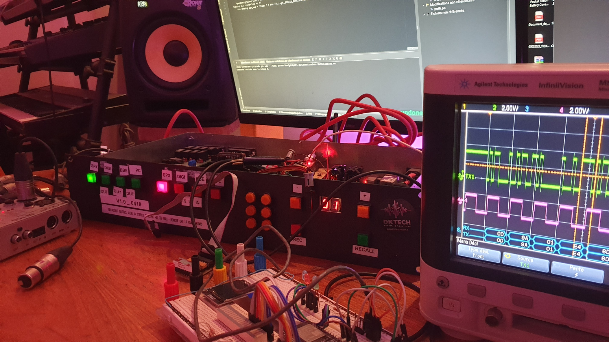

# Projet ESP32 Matrix Audio Controller



## Description
Ce projet utilise un ESP32 pour gérer une matrice audio programmable, permettant de router des effets audio externes de manière dynamique. L’interface utilisateur est accessible via un serveur web intégré, et les configurations d’effets sont envoyées en temps réel à l’ESP32 pour contrôler les entrées et sorties audio.

## Fonctionnalités
- Communication série bidirectionnelle avec le matériel Matrix (9600 bauds)
- Interface web pour le contrôle à distance
- Gestion des presets audio
- Contrôle des effets audio
- Sauvegarde de la configuration dans la mémoire flash (SPIFFS)
- Support WiFi pour le contrôle à distance

## Matériel Requis
- ESP32 DevKit ou compatible
- Matériel Matrix Audio
- Câble USB pour la programmation
- Connexion WiFi

## Installation

### Prérequis
- PlatformIO IDE ou VSCode avec l'extension PlatformIO
- Git

### Dépendances
- ArduinoJson (v7.4.1)
- ESP Async WebServer (v1.2.4)
- AsyncTCP (v1.1.1)
- ESPAsyncTCP (v1.2.2)

### Configuration
1. Cloner le dépôt :
```bash
git clone [URL_DU_REPO]
```

2. Ouvrir le projet dans PlatformIO

3. Configurer les paramètres WiFi dans le code :
```cpp
const char* ssid = "VOTRE_SSID";
const char* password = "VOTRE_MOT_DE_PASSE";
```

4. Compiler et uploader le programme

## Configuration des Pins
- Serial Debug : GPIO1 (TX) et GPIO3 (RX) à 115200 bauds
- mySerial (Protocole Matrix) : GPIO16 (TX) et GPIO17 (RX) à 9600 bauds

## Utilisation
1. Connecter l'ESP32 au matériel Matrix
2. Alimenter l'ESP32
3. Se connecter au WiFi configuré
4. Accéder à l'interface web via l'IP de l'ESP32

## Structure du Projet
```
├── src/                    # Code source
│   ├── main.cpp           # Programme principal
│   ├── HW_SendRsV3.cpp    # Implémentation du protocole Matrix
│   └── HW_SendRsV3.h      # Définition du protocole Matrix
├── data/                   # Fichiers pour SPIFFS
│   └── index.html         # Interface web
├── platformio.ini         # Configuration PlatformIO
└── README.md              # Documentation
```

## Protocole de Communication
Le protocole de communication avec le matériel Matrix utilise un format spécifique :
```
[Header(13)] [Command] [Data...] [Checksum]
```

## Dépendances
- Framework Arduino-ESP32
- ArduinoJson v7.4.1
- ESP Async WebServer v1.2.4
- AsyncTCP v1.1.1
- ESPAsyncTCP v1.2.2

## Licence
[À définir]

## Auteur
[Votre nom]

## Support
Pour toute question ou problème, veuillez ouvrir une issue sur GitHub.

| Action                                 | Commande                          | Explication                                           |
|----------------------------------------|---------------------------------|-----------------------------------------------------|
| Compiler le projet                     | `pio run`                       | Compile le firmware sans téléverser                  |
| Téléverser le firmware                 | `pio run --target upload`       | Compile et téléverse le firmware sur l'ESP32        |
| Ouvrir le moniteur série à 115200 bauds | `pio device monitor --baud 115200` | Affiche les messages du port série (debug, logs)    |
| Arrêter le moniteur série              | `Ctrl+C`                       | Ferme le moniteur dans le terminal                    |
| Uploader les fichiers SPIFFS/LittleFS | `pio run --target uploadfs`     | Téléverse le contenu du dossier `data/` dans l'ESP32|
| Changer de port série (ex : COM9)     | Ajouter dans `platformio.ini` :<br>`upload_port = COM9`<br>`monitor_port = COM9` | Définit le port pour l'upload et le moniteur série  |
| Nettoyer le projet                     | `pio run --target clean`        | Supprime les fichiers de compilation                  |

1. **ArduinoJson**
   - Version : 7.4.1
   - Auteur : Benoit Blanchon
   - URL : https://github.com/bblanchon/ArduinoJson

2. **ESP Async WebServer**
   - Version : 1.2.4
   - Auteur : Hristo Gochkov
   - URL : https://github.com/me-no-dev/ESPAsyncWebServer

3. **ESPAsyncTCP** (dépendance pour ESP8266)
   - Version : 1.2.2
   - Auteur : Hristo Gochkov
   - URL : https://github.com/me-no-dev/ESPAsyncTCP

4. **AsyncTCP** (pour ESP32)
   - Version : 1.1.1
   - Auteur : Hristo Gochkov
   - URL : https://github.com/me-no-dev/AsyncTCP

Ces bibliothèques sont automatiquement installées par PlatformIO lors de la première compilation du projet. Si vous souhaitez installer manuellement ces versions spécifiques, vous pouvez utiliser les commandes suivantes dans PlatformIO :

```bash
pio lib install "bblanchon/ArduinoJson@7.4.1"
pio lib install "me-no-dev/ESP Async WebServer@1.2.4"
```

Les dépendances AsyncTCP et ESPAsyncTCP seront automatiquement installées car elles sont des dépendances requises par ESP Async WebServer.
